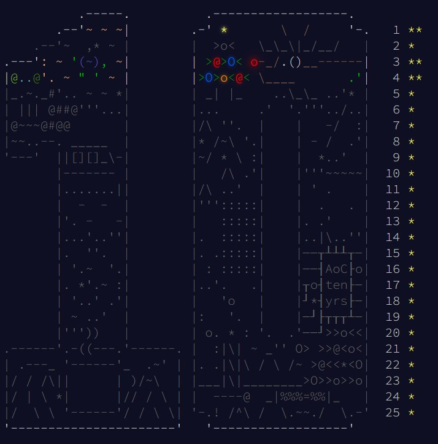

# Advent of Code 2024 solutions

This project is officially completed! All days of advent of code have had at least their first parts solved :D




This project uses typescript and yarn

# Installation
Make sure to use yarn to install dependencies
```bash
yarn
```

# Preparing solution scripts for usage
Since advent of code input files are copyrighted, you must provide your own input files,
each day might require a different solution file, so please check the relevant
typescript files to ensure that the proper data file and filename is being provided.

# Running the different solution scripts
You can run whichever day's solution typescript file that you want
```bash
# As an example, this will run day 6 solution
yarn s 06
```

